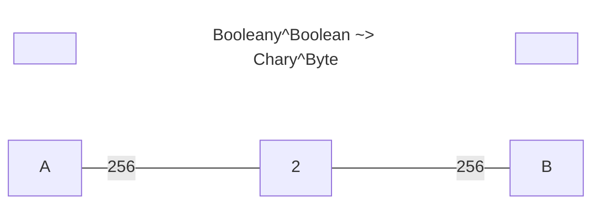
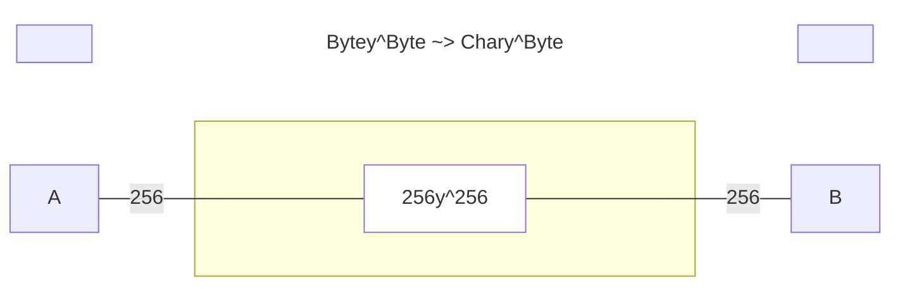

# polynomial

Based on the polynomial functors described in [Niu and Spivak](https://topos.site/poly-book.pdf)

---

### Add the dependencies:
 - library for Scala 3 (JS, JVM, and Native platforms)
 - mermaid integration (optional)
 
```scala
"com.julianpeeters" %% "polynomial" % "0.2.0" 
"com.julianpeeters" %% "polynomial-mermaid" % "0.2.0"
```

---

### Modules
 - [`polynomial`](#polynomial-1): objects, morphisms, products
 - [`polynomial-mermaid`](#polynomial-mermaid): print mermaid chart definitions

### `polynomial`

The `polynomial` library provides the following implementation of poly:
 - objects: built-in ADTs and type aliases, for `Binomial` functors, etc.
 - morphisms: `PolyMap`, a natural transformation between polynomial functors
 - products: `Tensor`, a parallel product, implemented as match types

```scala
import polynomial.`object`.*
import polynomial.morphism.~>
import polynomial.product.⊗

type `2y⁵¹²`           = Monomial.Interface[(Byte, Boolean), Boolean, _]
type `y² + 2y`         = Binomial[Boolean, Unit, Unit, Boolean, _]
type `y² + 2y + 1`     = Trinomial[Boolean, Unit, Unit, Boolean, Nothing, Unit, _]
type `2y²`             = Monomial.Store[Boolean, _] // isomorphic to cats.data.Store
type `0`               = Monomial.Interface[Nothing, Any, _]
type `1`               = Monomial.Interface[Unit, Nothing, _]
type `y² + 2y → 2y⁵¹²` = (`y² + 2y` ~> `2y⁵¹²`)[_]
type `4y⁴`             = (`2y²` ⊗ `2y²`)[_]
```

#### FAQ

>Q: What are we losing by using simple types rather than dependent types?

>A: Simple types can easily model monomial lenses, yet they are not flexible
>enough to model fully dependent lenses.
>
>However, a rich subset of dependent lenses can be implemented, under the
>following constraints:
> - function types may not depend on just any value, but may, by exploiting Scala's subtyping of ADTs, depend on classes of values
> - function types may not depend on just any type, but may, by exploiting Scala's match types, depend on types that abstract over arities
>
>These constraints liberate a subcategory of Poly wherein multi-term
>polynomial lenses "fit" within the shape of a monomial lens, as long as the
>folliwing conditions are met:
> - the positions and directions of the polynomial are related by an ADT
> - the number of terms in the polynomial is equal to the number of members of the ADT
>
>For example, `Binomial` lens can be pameterized by `Option` such that its
>terms are exponentiated by `Some[A]` and `None.type`, and behaves as a
>"dual-laned" monomiallens:
>
```mermaid
graph LR;
  TitleStart[ ]:::hidden~~~TitleBody[Booleany^Boolean ~> None.typey^Some[Byte] + Some[String]y^None.type]:::title~~~TitleEnd[ ]:::hidden
  A:::hidden---|Some[Byte]<br>None.type|S[Boolean]---|None.type<br>Some[String]|B:::hidden;

classDef empty fill:background;
classDef point width:0px, height:0px;
classDef title stroke-width:0px, fill:background;
```

### `polynomial-mermaid`

Certain lenses can be interpreted graphically. Given a `Mermaid` instance for a
`PolyMap`, a [mermaid](https://mermaid.js.org/intro/) flowchart definition can be printed.

```scala
import polynomial.`object`.Monomial.{Store, Interface}
import polynomial.mermaid.{Format, Mermaid, given}
import polynomial.morphism.~>

type F[Y] = (Store[Boolean, _] ~> Interface[Byte, Char, _])[Y]

val M: Mermaid[F] = summon[Mermaid[F]]
// M: Mermaid[F] = polynomial.mermaid.Mermaid$$anon$1@5c329245

println(M.showTitledGraph(titleFmt = Format.Cardinal, graphFmt = Format.Specific))
// ```mermaid
// graph LR;
//   TitleStart[ ]:::hidden~~~TitleBody[Booleany^Boolean ~> Chary^Byte]:::title~~~TitleEnd[ ]:::hidden
//   A:::hidden---|256|S[2]---|256|B:::hidden;
// 
// classDef empty fill:background;
// classDef point width:0px, height:0px;
// classDef title stroke-width:0px, fill:background;
// ```
```


(Note: if GitHub is ignoring the `:::hidden` attribute, try [mermaid.live](https://mermaid.live/))

### Labels and Titles

The following formats are supported:
 - `Cardinal`: render exponents and coefficients as integer values
 - `Custom`: render custom labels for variables, exponents and coefficients
 - `Generic`: render exponents and coefficients as, e.g., `A` instead of a `Byte`
 - `Specific`: render exponents and coefficients as, e.g., `Byte` instead of a `A`

### Supported Lenses

Built-in instances are provided for the following lenses:

<details><summary>click to expand</summary>

##### Example: monomial state lens `Store[S, _] ~> Interface[A, B, _]`


##### Example: monomial lens `Interface[A1, B1, _] ~> Interface[A2, B2, _]`


##### Example: binomial state lens `Store[S, _] ~> Interface[A1, B1, A2, B2, _]`


</details>