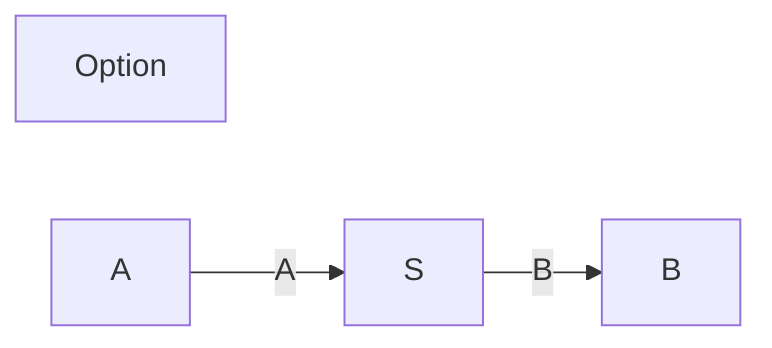

# polynomial

Based on the polynomial functors described in [Niu and Spivak](https://topos.site/poly-book.pdf)

### Add the dependency:
 - libarary for Scala 3 (JS, JVM, and Native platforms)
 - depends on cats 2.10 (for the `Store` monomial)
 
```scala
"com.julianpeeters" %% "polynomial" % "0.1.0"
```

### Modules
 - [`polynomial`](#polynomial-1): objects, morphisms, products
 - [`polynomial-mermaid`](#polynomial-mermaid): generate mermaid chart definitions

#### `polynomial`

The `polynomial` library provides the following implementation of poly:
 - objects: built-in ADTs representing `Monomial`, `Binomial`, `Trinomial`, and `Store` functors
 - morphisms: `PolyMap`, a natural transformation between polynomial functors
 - products: `Tensor`, a type match on functors, yielding a parallel product

```scala
import polynomial.`object`.{Binomial, Monomial, Store}
import polynomial.morphism.~>
import polynomial.product.⊗

type `2y²`             = Store[Boolean, _]
type `2y⁵¹²`           = Monomial[(Byte, Boolean), Boolean, _]
type `y² + 2y`         = Binomial[Boolean, Unit, Unit, Boolean, _]
type `y² + 2y → 2y⁵¹²` = (`y² + 2y` ~> `2y⁵¹²`)[_]
type `4y⁴`             = (`2y²` ⊗ `2y²`)[_]
```

#### `polynomial-mermaid`

Certain lenses can be interpreted graphically. Given a `Mermaid` instance for a
`PolyMap`, a mermaid chart definition can be printed:

```scala
import polynomial.`object`.{Store, Monomial}
import polynomial.mermaid.Mermaid
import polynomial.morphism.~>

type P[Y] = (Store[Int, _] ~> Monomial[Char, Unit, _])[Y]

println(summon[Mermaid[P]].showSpecific)
// ```mermaid
// graph LR;
//   Option
// 
//   A:::hidden-->|A|S-->|B|B:::hidden;
// ```
```


(Note: if GitHub is ignoring the `:::hidden` attribute, try [mermaid.live](https://mermaid.live/))


```scala
import polynomial.`object`.Monomial
import polynomial.mermaid.Mermaid
import polynomial.morphism.~>
import polynomial.product.⊗

class Plant[Y](in: ((Byte, Byte )=> Char) => Y, out: Char) extends Monomial[((Byte, Byte) => Char), Char, Y](in, out)
class Controller[Y](in: Char => Y, out: Byte => Char) extends Monomial[Char, Byte => Char, Y](in, out)
class System[Y](in: Byte => Y, out: Byte => Char) extends Monomial[Byte, Byte => Char, Y](in, out)
type ω[Y] = ((Plant ⊗ Controller) ~> System)[Y]

println(summon[Mermaid[(Monomial[(Byte, Byte => Char), Char, _] ⊗ Monomial[Char, Byte => Char, _]) ~> Monomial[Byte, Byte => Char, _]]].showGeneric)
// ```mermiad
// graph LR;
//   A:::hidden ----|A|P[ ]:::hole
//   subgraph System[ ]
//       P & Q[ ]:::hole ---|C|Split[ ]:::empty
//       Q ---|B|P
//   end
//   Split --- E:::hidden
//   classDef empty width:0px,height:0px;
//   classDef hole fill:background;
// ```
```