# polynomial

Based on the polynomial functors described in [Niu and Spivak](https://topos.site/poly-book.pdf)



---

### Add the dependencies:
 - libarary for Scala 3 (JS, JVM, and Native platforms)
 - depends on cats 2.10 (for the `Store` monomial)
 
```scala
"com.julianpeeters" %% "polynomial" % "0.1.0"         // core library (required)
"com.julianpeeters" %% "polynomial-mermaid" % "0.1.0" // mermaid integration (optional)
```

---

### Modules
 - [`polynomial`](#polynomial-1): objects, morphisms, products
 - [`polynomial-mermaid`](#polynomial-mermaid): print mermaid chart definitions

### `polynomial`

The `polynomial` library provides the following implementation of poly:
 - objects: built-in ADTs and type aliases, for `Binomial` functors, etc.
 - morphisms: `PolyMap`, a natural transformation between polynomial functors
 - products: `Tensor`, a parallel product, implemented as match types

```scala
import polynomial.`object`.*
import polynomial.morphism.~>
import polynomial.product.⊗

type `2y⁵¹²`           = Monomial[(Byte, Boolean), Boolean, _]
type `y² + 2y`         = Binomial[Boolean, Unit, Unit, Boolean, _]
type `y² + 2y + 1`     = Trinomial[Boolean, Unit, Unit, Boolean, Nothing, Unit, _]
type `2y²`             = Store[Boolean, _]
type `0`               = Initial[_]
type `1`               = Terminal[_]
type `y² + 2y → 2y⁵¹²` = (`y² + 2y` ~> `2y⁵¹²`)[_]
type `4y⁴`             = (`2y²` ⊗ `2y²`)[_]
```

### `polynomial-mermaid`

Certain lenses can be interpreted graphically. Given a `Mermaid` instance for a
`PolyMap`, a [mermaid](https://mermaid.js.org/intro/) flowchart definition can be printed.

```scala
import polynomial.`object`.{Store, Monomial}
import polynomial.mermaid.{Format, Mermaid, given}
import polynomial.morphism.~>

type F[Y] = (Store[Boolean, _] ~> Monomial[Byte, Char, _])[Y]

val M: Mermaid[F] = summon[Mermaid[F]]
// M: Mermaid[F] = polynomial.mermaid.Mermaid$$anon$1@19f0b089

println(M.showTitledGraph(titleFmt = Format.Cardinal, graphFmt = Format.Specific))
// ```mermaid
// graph LR;
//   TitleStart[ ]:::hidden~~~TitleBody[<span style="font-family:Courier">Boolean</span>𝑦<sup><span style="font-family:Courier">Boolean</span></sup> → <span style="font-family:Courier">Char</span>𝑦<sup><span style="font-family:Courier">Byte</span></sup>]:::title~~~TitleEnd[ ]:::hidden
//   A:::hidden---|256|S[2]---|256|B:::hidden;
// 
// classDef empty fill:background;
// classDef point width:0px, height:0px;
// classDef title stroke-width:0px, fill:background;
// ```
```


```mermaid
graph LR;
  TitleStart[ ]:::hidden~~~TitleBody[<span style="font-family:Courier">Boolean</span>𝑦<sup><span style="font-family:Courier">Boolean</span></sup> → <span style="font-family:Courier">Char</span>𝑦<sup><span style="font-family:Courier">Byte</span></sup>]:::title~~~TitleEnd[ ]:::hidden
  A:::hidden---|256|S[2]---|256|B:::hidden;

classDef empty fill:background;
classDef point width:0px, height:0px;
classDef title stroke-width:0px, fill:background;
```

(Note: if GitHub is ignoring the `:::hidden` attribute, try [mermaid.live](https://mermaid.live/))

### Labels and Titles

The following formats are supported:
 - `Cardinal`: render exponents and coefficients as integer values
 - `Custom`: render custom labels for variables, exponents and coefficients
 - `Generic`: render exponents and coefficients as, e.g., `A` instead of a `Byte`
 - `Specific`: render exponents and coefficients as, e.g., `Byte` instead of a `A`

### Supported Lenses

Built-in instances are provided for the following lenses:

<details><summary>click to expand</summary>

##### Example: monomial state lens `Store[S, _] ~> Monomial[A, B, _]`

```mermaid
graph LR;
  TitleStart[ ]:::hidden~~~TitleBody[<span style="font-family:Courier">S</span>𝑦<sup><span style="font-family:Courier">S</span></sup> → <span style="font-family:Courier">B</span>𝑦<sup><span style="font-family:Courier">A</span></sup>]:::title~~~TitleEnd[ ]:::hidden
  A:::hidden---|<span style="font-family:Courier">A</span>|S[<span style="font-family:Courier">S</span>]---|<span style="font-family:Courier">B</span>|B:::hidden;

classDef empty fill:background;
classDef point width:0px, height:0px;
classDef title stroke-width:0px, fill:background;
```


##### Example: monomial lens `Monomial[A1, B1, _] ~> Monomial[A2, B2, _]`

```mermaid
graph LR;
  TitleStart[ ]:::hidden~~~~TitleBody[<span style="font-family:Courier">B<sub>1</sub></span>𝑦<sup><span style="font-family:Courier">A<sub>1</sub></span></sup> → <span style="font-family:Courier">B<sub>2</sub></span>𝑦<sup><span style="font-family:Courier">A<sub>2</sub></span></sup>]:::title~~~~TitleEnd[ ]:::hidden
  A:::hidden---|<span style="font-family:Courier">A<sub>2</sub></span>|A2[ ]:::point
subgraph s[ ]
  A2:::point---MermaidPMono
  MermaidPMono[<span style="font-family:Courier">B<sub>1</sub></span>𝑦<sup><span style="font-family:Courier">A<sub>1</sub></span></sup>]:::empty
  MermaidPMono---B2
end
B2[ ]:::point---|<span style="font-family:Courier">B<sub>2</sub></span>|B:::hidden;

classDef empty fill:background;
classDef point width:0px, height:0px;
classDef title stroke-width:0px, fill:background;
```


##### Example: binomial state lens `Store[S, _] ~> Binomial[A1, B1, A2, B2, _]`

```mermaid
graph LR;
  TitleStart[ ]:::hidden~~~TitleBody[<span style="font-family:Courier">S</span>𝑦<sup><span style="font-family:Courier">S</span></sup> → B<sub>1</sub>𝑦<sup>A<sub>1</sub></sup> + B<sub>2</sub>𝑦<sup>A<sub>2</sub></sup>]:::title~~~TitleEnd[ ]:::hidden
  A:::hidden---|<span style="font-family:Courier">A<sub>1</sub></span><br><span style="font-family:Courier">A<sub>2</sub></span>|S[<span style="font-family:Courier">S</span>]---|<span style="font-family:Courier">B<sub>1</sub></span><br><span style="font-family:Courier">B<sub>2</sub></span>|B:::hidden;

classDef empty fill:background;
classDef point width:0px, height:0px;
classDef title stroke-width:0px, fill:background;
```



</details>