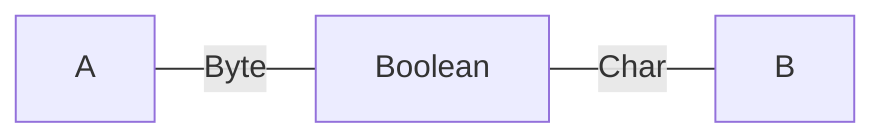

# polynomial

Based on the polynomial functors described in [Niu and Spivak](https://topos.site/poly-book.pdf)

---

### Add the dependencies:
 - library for Scala @SCALA@ (JS, JVM, and Native platforms)
 - mermaid integration (optional)
 
```scala
"com.julianpeeters" %% "polynomial" % "@VERSION@" 
"com.julianpeeters" %% "polynomial-mermaid" % "@VERSION@"
```

---

### Modules
 - [`polynomial`](#polynomial-1): objects, morphisms, products
 - [`polynomial-mermaid`](#polynomial-mermaid): print mermaid chart definitions

### `polynomial`

The `polynomial` library provides the following implementation of poly:
 - objects: built-in ADTs for monomial, binomial, and trinomial `Store` and `Interface` functors
 - morphisms: `PolyMap`, or `~>`, a natural transformation between polynomial functors
 - products:
   - `Composition`, or `◁`, a composition product implemented as match types
   - `Tensor`, or `⊗`, a parallel product implemented as match types

```scala mdoc
import polynomial.`object`.*
import polynomial.morphism.~>
import polynomial.product.{◁, ⊗}

type `2y⁵¹²`           = Monomial.Interface[(Byte, Boolean), Boolean, _]
type `y² + 2y`         = Binomial[Boolean, Unit, Unit, Boolean, _]
type `y² + 2y + 1`     = Trinomial[Boolean, Unit, Unit, Boolean, Nothing, Unit, _]
type `2y²`             = Monomial.Store[Boolean, _]
type `0`               = Monomial.Interface[Nothing, Nothing, _]
type `1`               = Monomial.Interface[Unit, Nothing, _]
type `y² + 2y → 2y⁵¹²` = (`y² + 2y` ~> `2y⁵¹²`)[_]
type `4y⁴`             = (`2y²` ⊗ `2y²`)[_]
type `8y⁴`             = (`2y²` ◁ `2y²`)[_]
```

#### FAQ

>Q: What are we losing by using simple types rather than dependent types?

>A: Simple types can easily model monomial lenses, but they are not flexible
>enough to model fully dependent lenses.
>
>However, a rich subset of dependent lenses can be implemented, under the
>following constraints:
> - the positions and directions of the polynomial are related by an ADT
> - the number of terms in the polynomial is equal to the number of members of the ADT
>
>For example, `Binomial` lens can be pameterized by `Option` such that its
>terms are exponentiated by `Some[A]` and `None.type`, and behaves as a
>"dual-laned" monomial lens.

### `polynomial-mermaid`

Certain lenses can be interpreted graphically. Given a `Mermaid` instance for a
`PolyMap`, a [mermaid](https://mermaid.js.org/intro/) flowchart definition can
be printed, with titles and labels in the following formats:
 - `Cardinal`: render exponents and coefficients as integer values
 - `Custom`: render custom labels for variables, exponents and coefficients
 - `Generic`: render exponents and coefficients as, e.g., `A` instead of a `Byte`
 - `Specific`: render exponents and coefficients as, e.g., `Byte` instead of a `A`


```scala mdoc:reset
import polynomial.`object`.Monomial.{Store, Interface}
import polynomial.mermaid.{Format, Mermaid, given}
import polynomial.morphism.~>

type F[Y] = (Store[Boolean, _] ~> Interface[Byte, Char, _])[Y]

val M: Mermaid[F] = summon[Mermaid[F]]

println(M.showGraph(graphFmt = Format.Specific))
```




```scala mdoc:reset:passthrough
import polynomial.`object`.Monomial
// import polynomial.mermaid.{Format, Mermaid, given}
import polynomial.morphism.~>
import polynomial.product.⊗

type Plant[Y]      = Monomial.Interface[(Byte, Char), Char, Y]
type Controller[Y] = Monomial.Interface[Char, Char, Y]
type System[Y]     = Monomial.Interface[Byte, Char, Y]

type F[Y] = ((Plant ⊗ Controller) ~> System)[Y]

// println(summon[Mermaid[F]].showTitledGraph(titleFmt = Format.Generic, graphFmt = Format.Generic))
```

(Note: GitHub ignores formatting, please use [mermaid.live](https://mermaid.live/))